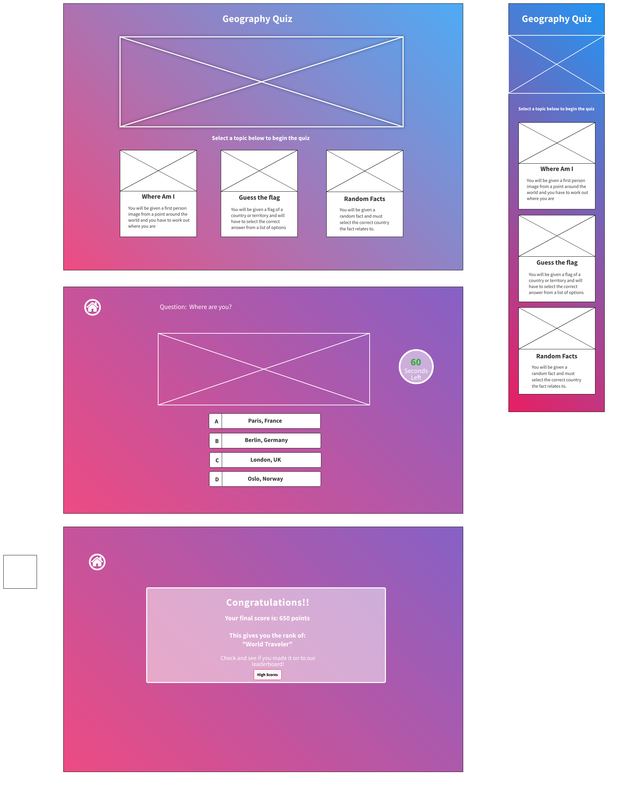
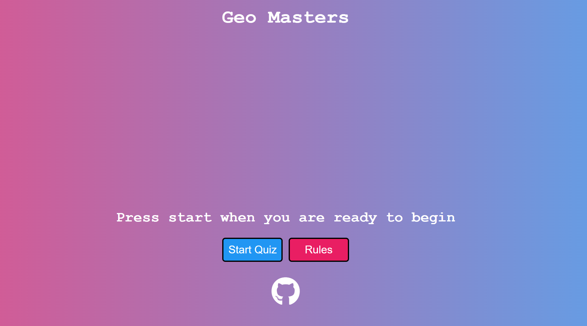
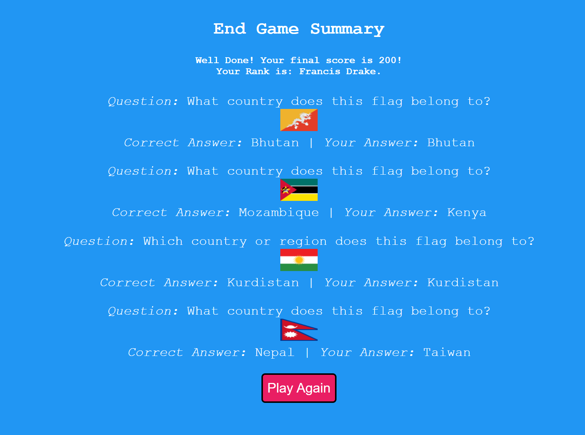

# Geo Masters

## A Geography Quiz based Website
> Geo Masters is a knowledge based quiz game that centers around the theme of geography . The user is given an opportunity to play one of two games against a clock to  select the correct answer from 4 options and earn more points.

>The user has the option to read the rules of the game to better understand the format and once they have decided which game they want to play they can then start the game.

> The two available games are: Interesting Facts which is random but fun facts about random countries from all over the word. The second game is Flags. This game presents the user with obscure and interesting flags and the users goal is to figure out which country the flag belongs to.
### - By Alan Bushell

## **[Live site](https://alan-bushell.github.io/geo-masters/)**

------------------------------------------------------------------

## **[Repository](https://github.com/Alan-Bushell/geo-masters)**
------------------------------------------------------------------
  
## Table of contents

 1. [ UX ](#ux)
 2. [ Features ](#features)  
 3. [ Features Left to Implement ](#left)  
 4. [ Technology used ](#tech) 
 5. [ Testing ](#testing)  
 6. [ Bugs ](#bugs)  
 7. [ Deployment](#deployment)
 8. [ Credits](#credits)
 9. [ Content](#content)  
 10. [ Acknowledgements](#acknowledgements)  

## UX

### Pre-project Planning

> For project 2 I decided early on I wanted to create a quiz game that I would like to play. I have a love of travelling and find Geography incredibly interesting so I decided on this as my theme.

> Rather than just making a generic quiz site I wanted to add some extra elements that I felt would have given the typical quiz site a fun spin.

>I decided I wanted to give the user a couple of options on which game they would like to play. I wanted to keep the overarching theme the same while giving clear differences to the types of questions that would be asked.

> From here I decided on:

 - Interesting Facts
 - Flags

> I also wanted to add a countdown timer to create urgency & a scoring system that was more relative to how quickly you answered the question rather than if you just got it correct or not.

# UX design

##### Color
As my first project was a minimalistic black & white themed site I decided this project should have plenty of color.
To start I decided on a nice vibrant linear gradient background ranging from a nice Pink(rgba(233, 30, 99, .8)) to Blue (rgba(33, 150, 243, .8))

As this is a single page game the background is constant across the experience except for pop up modals which are the above Blue and the final score modal which covers the entirety of the screen in the same Blue.

##### Font
As the goal of the site was to provide users with clear instructions and questions, I decided I wanted a clear legible font that would not distort or delay the readability. The base font selected Courier New.

##### Images
The images on this site are used to convey logic to the users when they select the quiz type they might want to try or even the questions themselves. 
**All the images selected for this project came from pixabay.com and pexels.com.**

## User Stories

### User
> As a user I want to be able to play a fun and interesting game  
> As a user I want have a choice of what type of game I would like to play
> As a user I want to get a score from the quiz to mark my progress 
> As a user I want to be able to see the rules for the quiz before I start  
> As a user I want to play again when I complete the quiz

## Wireframes

### Desktop & Mobile Wireframe

## Features

### index.html

#### Welcome Area

#### Game Category Area

#### Rules Modal

Throughout the design process my initial approach was to have a landing page where the user would select their quiz type and be taken to the Quiz Dashboard.

However because this project was going to include Javascript I felt like I could manipulate the DOM to create a single page quiz game app which is what I have done.

By utilizing display properties effectively I was able to reduce the two / three page site down to one and create a seamless experience for my users.

 1. From page load the user will be presented with the welcome message, game choices and the rules modal button.
 2. Once they select a game the main page dashboard is hidden & the user is presented with a start game button and the rules again to go over.
 3. Once the user clicks start game button the quiz dashboard is then presented with questions, answers and a countdown clock.
 4. Once the final question has been answered, the end game modal will cover the screen and the quiz dashboard will be hidden. This endgame modal will display the users rank, their final score and show them the questions they were asked, the correct answer and their answer.

#### Pregame lobby

#### Quiz Dashboard

#### Countdown Clock
> The countdown clock was an essential part of my pre-project planning. I wanted to make dynamic and it actually plays a big part in my quiz.

 - The countdown clock Starts when a question is presented to the user to display how long they have left to answer the question.
 - If the user does not answer in time the clock will state "Times Up" to the user briefly before moving on to the next question.
 - As the clock counts down it changes color.
	 - From 15 seconds to 10 seconds it is a nice safe Green Color
	 - From 10 seconds to 5 seconds it is a warning orange / amber color
	 - From 5 seconds to 1 second it is a danger red color and includes a shaking motion to add urgency to the user
	 - When it reaches 0 the clock then changes to "Times Up" and either pulls the next question or calls the end game function which brings up the end game modal.
 - The clock also is part of the scoring system in the quiz games. If your answer is correct we check and see how much time you have left and it is factored into your score. 
	 - If you have over 10 seconds left you score 100 points.
	 - If you have between 6-10 seconds left you score 75 points.
	 - If you have less than 10 seconds left you score 50 points.
	 - If you answer incorrectly or if you run out of time then you score 0 points.

#### End Game Function

The end game function is called when there are either no questions left in the list or if the user reaches the max-question count. 
Once this happens the endGame function calls and it displays a final score modal that presents users with their score, ranking and a little message depending on how they did.
The user can also see a record of the questions, images, correct answer and their answer so they can learn and get feedback from their experience.

# Features Left to implement
> Add a high score tracker for the user
> Add a highscores modal for each seperate game
> Be able to input username to push to a leaderboard

### Additional ideas

> Ideally I would like to add more complex quizzes and offer a range of topics related to the overarching theme.
> One prospective idea was to find popular tourist locations on googlestreet view and allow the user brief moments to slightly pan and decide where they are.
> Ability to allow a user to complete a specific quiz and share the same version of the quiz with a friend as a form of head 2 head competition.

# Technology Used
### Html
> Used to structure my webpages and the bones of any web project

### CSS
> Used to style and add layout to my project.

### Javascript
> Used to make the site dynamic and to present, select and store the users answers and then provide a score based on the time it took them to answer.

### Font Awesome
> Used for the home icon & the github icon used in this project.

# Testing

### Testing Phase

#### Manual Testing

| Test | Result |
|--|--|
|When flags game is selected correct game runs| Pass |
|When random facts game is selected correct game runs|Pass|
|When the rules button is clicked the modal pops up|Pass|
|The rules modal closes when user clicks the close button|Pass|
|The rules modal closes when the user clicks outside of the modal|Pass|
|When game starts question, answers and images load correctly|Pass|
|When game starts clock begins countdown|Pass|
|When user selects answer, new question and answers are pulled|Pass|
|When new question is called the clock restarts|Pass|
|The correct answers appear with the correct questions|Pass|
|The correct image appears for the correct question|Pass|
|When the user answers a question the counter increases|Pass|
|When the user answers the final question the game directs to the end game modal|Pass|
|The end game modal displays the users final score & rank|Pass|
|The end game modal displays the questions and answers the user provided and correct answer|Pass|
|When the user clicks Play Again the page reloads back to the start|Pass|

### User testing

**User responsive testing**

## Google Lighthouse Testing

### Desktop

### Mobile

## HTML W3 Validation

### index.html

#### Result: No Errors

### CSS Validation

#### Result: No Errors

### JS Hint Checker

#### Result: No Warnings

## **Bugs**
> Issues with clock not resetting when new question was pulled. Second instance of clock was called and it looped between the previous count and new count **fixed**
> Issue with images not displaying correctly and forcing the page too wide on smaller displays. **fixed**
> Issue with endgame function being called every 30 seconds and repeating user congratulations message **fixed**
> Endgame modal overlapping and not allowing scroll on devices smaller than 400px. Play again button hidden and user cannot naviagte away. **fixed**

## Deployment

> To deploy the project I followed these steps starting from the main project repository [here]().

 1. Clicked on `Settings` on the navigation menu in the repository
 2. I then selected the `Pages` menu on the side bar.
 3. In the first dropdown menu labeled `Source` I selected the branch of the name `main` from the dropdown.
 4. In the next dropdown labeled `/root` I left as the default option.
 5. Selected Save
 
> I then received a notification from GitHub that my project is being deployed and after about 1 minute & a couple of refreshes of the page it was ready and live.

## Credits

### Links for images included below
> world-map.jpg : ('https://www.pexels.com/photo/world-map-illustration-592753/') Photo by Aaditya Arora

## Content & Resources

### Pixabay.com
> Images of flags sourced from pixabay

### Pexels.com
> Images used in this project.

### w3 schools
> Used for general lookup JS dom related queries and general styling css using js

### Stack Overflow
> Used to query issues relating programming issues relating to injecting html with JS

### Youtube.com
> Channels like **Florin Pop** & **Brad Traversy** helped understand different JS concepts throughout this project

### Code Institute
> Project created in line with course content and within project 2 scope.

## Acknowledgements

### Dick Vlandeeren
> My mentor who provided me with constructive feedback and positive reinforcement where applicable.
